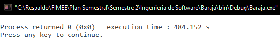
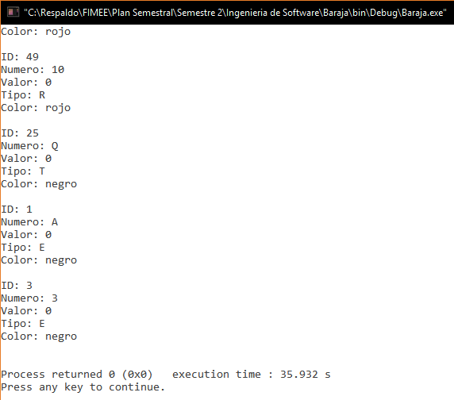
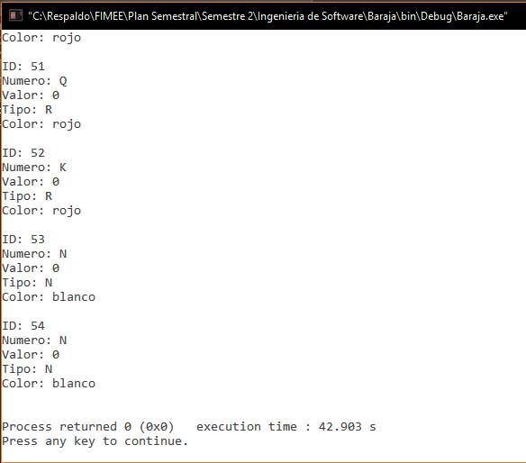
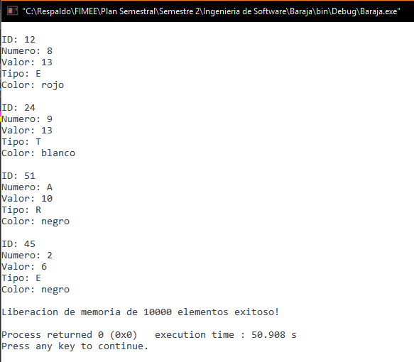
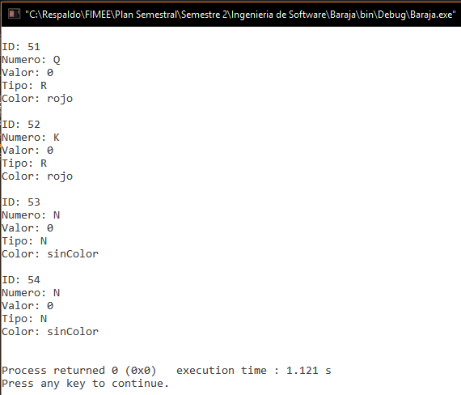
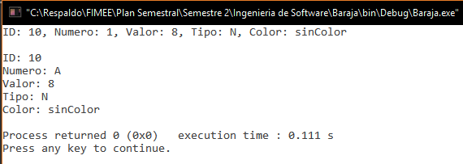

#Proyecto Baraja (Ingeniería de Software)

Documento que recaba todas las descripciones básicas y anotaciones que se han desarrollado, observaciones que se tienen y un apoyo en documentación del mismo proyecto realizado en lenguaje C. Se registran con fechas y observaciones en cada parte del programa.

##Actualizaciones
**26/Nov/16**. Se crearon las siguientes funciones (sin probar aún):  
- `int contarComodines (carta mano[])`  
- `int checarRepeticionTipo (carta mano[], char *tipo)`  
- `int comprobarColor (carta mano[], int comodines)`  
- `int probarColor (carta mano[], int posiciones[], int comodines)`.  

**26/Nov/16**. Se crearon las siguientes funciones (sin probar aún):  
- `int comprobarFullHouse (carta mano[], int comodines)`  
- `int probarFullHouse (carta mano[], int posiciones[], int comodines)`   

**25/Nov/16**. Se crearon las siguientes funciones (sin probar aún):  
- `int comprobarPoker (carta mano[], int comodines)`  
- `int probarPoker (carta mano[], int posiciones[], int comodines)`.  

**25/Nov/16**. Se crearon las siguientes funciones (sin probar aún):  
- `int probarTrio (carta mano[], int posiciones[], int comodines)`  
- `int comprobarTrio (carta mano[], int comodines)`.  

**24/Nov/16**. Se crearon las siguientes funciones (sin probar aún):  
- `int checarManoPC (jugador hp)`  
- `int cartaMasAlta (carta mano[])`  
- `void probarPar (carta mano[], int posiciones[])`  
- `int comprobarPares (carta mano[], int pares[], int comodines)`. 

**24/Nov/16**. Se reacomodó el código de pruebas (drivers de baraja y poker) en dos respectivos proyectos en CodeBlocks llamados *BarajaDriver* y *PokerDriver* ambos contenidos en la librería `/pruebas/`. 

**22/Nov/16**. Se crearon las siguientes funciones (sin probar aún):  
- `void inicioDescarte(int a[])`.  
- `int probarEscaleraReal (carta mano[], int posiciones[], char palo, int comodines)`.  
- `int comprobarEscaleraReal (carta mano[], char tipo, int comodines)`.  

**22/Nov/16**. Se creó la función `int comprobarEscaleraColor (carta mano[], char tipo, int comodines)` que comprueba si existe una escalera de color en la mano. 

**21/Nov/16**. Se creó la función `int probarEscaleraColor(carta mano[], int posiciones[], char palo, int comodines)` que analiza cuantas cartas se necesitan cambiar para formar una escalera de color y da también las posiciones de dichas cartas.  

**21/Nov/16**. Se modificó la función `void ordenarCartas(carta monton[], int length)` por `void ordenarCartas(carta monton[], int length, int v)` permitiendo ordenar las cartas del juego por valor o por número.

**16/Nov/16**. Se crearon las funciones (sin probar aún):  
- `void borde(int n)`.  
- `void datos(carta mano[], int jugador, int fondo, int apuesta, int oculto)`.  
- `int apostar(int *fondo, int *apuesta, int *total)`. 

**16/Nov/16**. Se crearon las funciones (sin probar aún):  
- `int sacarCarta(carta baraja[], carta mano[], int posicion, int carry, int max)`.  
- `int cambios(carta baraja[], carta mano[], int *carry, int max)`.  

**12/Nov/16**. Se crearon las funciones (sin probar aún):  
- `void asignarValor(carta baraja[], int length)`.  
- `void ordenarCartas(carta monton[], int length)`.  
- `int prioridadTipo(char tipo)`.  

**10/Nov/16**. Se realizaron las pruebas de la función `void imprimirMano(carta mano[])`. Los resultados de la prueba se pueden observar en la respectiva carpeta (`/pruebas/poker/imprimirMano`).  

  

**09/Nov/16**. Se realizaron las pruebas de la función `int repartirMano(carta baraja[], carta mano[], int n, int *carry, int max)`. Los resultados de la prueba se pueden observar en la respectiva carpeta (`/pruebas/poker/repartirMano`).  

  

**09/Nov/16**. Se realizaron las pruebas de la función `void quitarJokers(carta baraja[], carta nBaraja[])`. Los resultados de la prueba se pueden observar en la respectiva carpeta (`/pruebas/poker/quitarJokers`).  

  

**08/Nov/16**. Se realizaron las pruebas de la función `void barajear (carta baraja[])`. Los resultados de la prueba se pueden observar en la respectiva carpeta (`/pruebas/baraja/barajear`).  

  

**08/Nov/16**. Se corrigió el error de liberación de memoria de la función `void barajear (carta baraja[])`.

**05/Nov/16**. Se realizaron las pruebas de la función `int crearBaraja(carta cartas[])`. Los resultados de la prueba se pueden observar en la respectiva carpeta (`/pruebas/baraja/crearBaraja`).  

**05/Nov/16**. Se realizaron las pruebas de la función `void liberarMemoria(carta baraja[], int length)`. Los resultados de la prueba se pueden observar en la respectiva carpeta (`/pruebas/baraja/liberarMemoria`).  

**05/Nov/16**. Se realizaron las pruebas de la función `int definirCarta(int id, int num, int value, char type, char* color, carta *elemento)`. Los resultados de la prueba se pueden observar en la respectiva carpeta (`/pruebas/baraja/definirCarta`).  

  

**05/Nov/16**. Se modificó y se realizaron las pruebas de la función `void imprimirCaractBaraja(carta baraja[], int length)`. Los resultados de la prueba se pueden observar en la respectiva carpeta (`/pruebas/baraja/imprimirCaractBaraja`).  

**04/Nov/16**. Se modificó y se realizaron las pruebas de la función `void imprimirCaractCarta(carta nombre)` por lo que no se detectaron fallos. Se construyó con anterioridad su respectivo grafo y se calculó su complejidad. Toda esta información puede ser vista en la carpeta `/pruebas/baraja/imprimirCaractCarta`.

**02/Nov/16**. Se realizaron las pruebas de la estructura y la función `void imprimirElementoCarta (carta nombre, int n)` por lo que no se detectaron fallos. Se construyó con anterioridad su respectivo grafo y se calculó su complejidad. Toda esta información puede ser vista en la carpeta `/pruebas/baraja/imprimirElementoCarta`.

  
**29/Oct/16**. Se creó el documento README.md para describir características y dar soporte al código. Se comentó parte del código con las características generales de lo que realiza cada función en las librerías. El error aún no se ha corregido, por lo que se ha decidido darle prioridad a su solución antes de continuar para evitar mal funcionamiento del programa más adelante.

**28/Oct/16**. Detectado un error 255 con el compilador Codeblocks al correr n veces el programa, aún no se encuentra la razón de tal debido a que se presenta aparentemente al azar. Se agregan unas imágenes del ya mencionado. 

 

##Baraja
Librería que contiene las funciones básicas del manejo de los elementos de una baraja en C.

###baraja.h (NO PROBADA ✘)
- `typedef struct {...}carta` **(PROBADA ✔)**. Estructura creada para contener los elementos de id, número, valor, tipo y color de una carta. *ID*, que sirve para darle un valor único a la carta y pueda ser usado en alguna otra parte. *Numero* que da el valor que tiene "físico". *Valor* que es el valor que se le da dependiendo del juego. *Tipo* que es uno de los cuatro que existen (E: Espadas, T: Treboles, C: Corazones y R: Rombos). Y el elemento *color* es asignado con memoria dinámica que puede tener tres (rojo, negro y blanco|sinColor).
- `void imprimirElementoCarta (carta nombre, int n)` **(PROBADA ✔)**. Imprime el elemento específico de una carta. 
- `void imprimirCaractCarta(carta nombre)` **(PROBADA ✔)**. Imprime todas las características de una carta. 
- `void imprimirCaractBaraja(carta baraja[], int length)` **(PROBADA ✔)**. Imprime todas las características de un arreglo de cartas (baraja). 
- `int definirCarta(int id, int num, int value, char type, char* color, carta *elemento)` **(PROBADA ✔)**. Crea una carta con todos los elementos que contiene. 
- `void liberarMemoria(carta baraja[], int length)`**(PROBADA ✔)**.  Libera la memoria de los elementos de un arreglo que usan memoria dinámica. 
- `int crearBaraja(carta baraja[])` **(PROBADA ✔)**. Crea un arreglo de tipo carta (baraja) con todos los tipos de cartas, y los elementos de cada una de ellas.
- `void barajear (carta baraja[])` **(PROBADA ✔)**. Desordena la baraja para que los elementos siempre salgan de manera aleatoria.

###baraja.c

- `void imprimirElementoCarta (carta nombre, int n)`.  
Imprime uno de los distintos elementos sin espacios y sin secuencias de escape. 
	+ **CREADA 27/10/16**. Hay que colocar n para indicar que es lo que se quiere que se imprima (1 = id, 2 = numero, 3 = valor, 4 = tipo y 5 = color). El valor del número es cambiante tomando como -1(comodín) y mostrándolo como N, 1 (As) mostrándolo como A, 11 como J, 12 como Q y 13 como K. Como recibe n los siguientes elementos 1 = id, 2 = numero, 3 = valor, 4 = tipo y 5 = color, falta analizar si se puede realizar de otra manera.
- `void imprimirCaractCarta(carta nombre)`.  
Imprime TODAS las características de una carta para pruebas del programador. 
	+ **CREADA 27/10/16**. El valor de número es cambiante tomando como -1(comodín) y mostrándolo como N, 1 (As) mostrándolo como A, 11 como J, 12 como Q y 13 como K.
	+ **MODIFICADA 04/11/16**. Se simplificó la función mandando llamar `void imprimirElementoCarta (carta nombre, int n)` para imprimir cada elemento.
- `void imprimirCaractBaraja(carta baraja[], int length)`.  
Imprime TODAS las características de cada carta contenida en el arreglo.  
	+ **CREADA 27/10/16**. Se requiere el largo del arreglo para ver el límite dentro de un ciclo *for* que realiza la impresión de las cartas. Desconozco si se puede realizar sin que el programador tenga que ingresarlo como parámetro.
	+ **MODIFICADA 05/11/16**. Se simplificó la función mandando llamar `void imprimirCaractCarta(carta nombre)` para imprimir cada carta contenida en el arreglo (baraja).
- `int definirCarta(int id, int num, int value, char type, char* color, carta *elemento)`.  
Crea una carta a partir de todos los elementos que contiene.
	+ **CREADA 27/10/16**. Es necesario colocar todos y cada uno de los parámetros que requiere la función. El color se asigna por memoria dinámica, a lo que regresa 1 la función cuando no se pudo asignarle para tal objetivo. Un parámetro es un apuntador a donde se encuentra la carta que se le darán tales valores.  
- `void liberarMemoria(carta baraja[], int length)`.  
Libera la memoria usada en *color* de cada elemento del arreglo.
	+ **CREADA 27/10/16**. En este caso, recibe un arreglo de tipo carta y el largo de este. Libera memoria de cada uno de los elementos ayudado con un ciclo *for*.
- `int crearBaraja(carta baraja[])`.   
Crea un arreglo de tipo carta (baraja) con todos los tipos de cartas.
	+ **CREADA 27/10/16**. Se da como valor fijo del arreglo 54 elementos, 13 cartas de los 4 tipos distintos que existen, más dos comodines. Como no se pudo colocar los símbolos de cada tipo de carta estos se representan con E = Espadas, T = Tréboles, C = Corazones y R = Rombos. Aquí los comodines poseen un valor númerico de -1 (N). Regresa el valor de 1 en caso de que no se haya podido asignar la memoria.  
- `void barajear (carta baraja[])`.  
Desordena el arreglo para que usando el azar pueda alterar el orden.
	+ **CREADA 27/10/16**. Usa la funcion `rand()` para realizar la tarea indicada además de crear otro arreglo de tipo carta para poder reemplazar el orden sin alterar la baraja original. ***NOTA: No fue posible liberar memoria de un arreglo tipo carta creado para dar soporte para desordenar las cartas. Crea un error al correr el programa. Checar tal error***.
	+ **MODIFICADA 08/11/16**. Se corrigió el error de liberación de memoria de la función.
	

##Poker
Librería de C que contiene todas las reglas y características de este juego. Se apoya en las funciones hechas en `baraja.h`.

###poker.h (NO PROBADA ✘)
- `void quitarJokers(carta baraja[], carta nBaraja[])` **(PROBADA ✔)**. Quita dos elementos carta del arreglo y crea una nueva baraja sin ellos. 
- `int repartirMano(carta baraja[], carta mano[], int n, int *carry, int max)` **(PROBADA ✔)**. Toma del arreglo baraja cinco cartas para darle a cada jugador.
- `void imprimirMano(carta mano[])` **(PROBADA ✔)**. Imprime la mano que tiene el jugador.  
- `void asignarValor(carta baraja[], int length)` **(NO PROBADA ✘)**. Define el valor de las cartas a este juego en específico.  
- `void ordenarCartas(carta monton[], int length)` **(NO PROBADA ✘)**. Ordena las cartas de acuerdo al tipo y al valor de la carta para hacer un poco más visible la mano.  
- `int prioridadTipo(char tipo)` **(NO PROBADA ✘)**. Auxilia a la función `void ordenarCartas(carta monton[], int length)`. 
- `int sacarCarta(carta baraja[], carta mano[], int posicion, int carry, int max)` **(NO PROBADA ✘)**. Permite sacar una carta de la baraja y la reemplaza por la carta que se le indique.  
- `int cambios(carta baraja[], carta mano[], int *carry, int max)` **(NO PROBADA ✘)**. Realiza los cambios de cartas de los jugadores.  
- `void borde(int n)` **(NO PROBADA ✘)**. Imprime un par de líneas que simula un borde.  
- `void datos(carta mano[], int jugador, int fondo, int apuesta, int oculto)` **(NO PROBADA ✘)**. Imprime los datos básicos del jugador para que se pueda observar su avance en el juego.  
- `int apostar(int *fondo, int *apuesta, int *total)` **(NO PROBADA ✘)**. Registra la apuesta del jugador (humano).  
- `int probarEscaleraColor(carta mano[], int posiciones[], char palo, int comodines)` **(NO PROBADA ✘)**. Analiza cuantas cartas se necesitan cambiar para formar una escalera de color y da las posiciones de dichas cartas.  
- `int comprobarEscaleraColor (carta mano[], char tipo, int comodines)` **(NO PROBADA ✘)**. Checa si existe una escalera de color en la mano del jugador.  
- `void inicioDescarte(int a[])` **(NO PROBADA ✘)**. Inicializa un arreglo de 5 elementos a -1.  
- `int probarEscaleraReal (carta mano[], int posiciones[], char palo, int comodines)` **(NO PROBADA ✘)**. Analiza cuantas cartas se necesitan cambiar para formar una escalera real y da las posiciones de dichas cartas.  
- `int comprobarEscaleraReal (carta mano[], char tipo, int comodines)` **(NO PROBADA ✘)**. Checa si existe una escalera real en la mano del jugador.  
- `int checarManoPC (jugador hp)` **(NO PROBADA ✘)**. Permite checar las posibles jugadas de la computadora.  
- `int cartaMasAlta (carta mano[])` **(NO PROBADA ✘)**. Obtiene el ID de la carta más alta que se encuentra en la mano.   
- `void probarPar (carta mano[], int posiciones[])` **(NO PROBADA ✘)**. Da las 4 cartas que se deben cambiar para obtener mínimo un par.    
- `int comprobarPares (carta mano[], int pares[], int comodines)` **(NO PROBADA ✘)**. Comprueba si hay 1 o 2 pares en la mano.  
- `int probarTrio (carta mano[], int posiciones[], int comodines)` **(NO PROBADA ✘)**. Da las cartas faltantes para formar un trío, y las posiciones de cambio.  
- `int comprobarTrio (carta mano[], int comodines)` **(NO PROBADA ✘)**. Comprueba si en la mano existe un trio de cartas.  
- `int comprobarPoker (carta mano[], int comodines)` **(NO PROBADA ✘)**. Comprueba si en la mano existe una jugada poker.  
- `int probarPoker (carta mano[], int posiciones[], int comodines)` **(NO PROBADA ✘)**. Da las cartas faltantes para formar una jugada de poker y las posiciones de cambio.  
- `int comprobarFullHouse (carta mano[], int comodines)` **(NO PROBADA ✘)**. Comprueba si en la mano existe una jugada full.  
- `int probarFullHouse (carta mano[], int posiciones[], int comodines)` **(NO PROBADA ✘)**. Da las cartas faltantes para formar una jugada full y las posiciones de cambio.  
- `int contarComodines (carta mano[])` **(NO PROBADA ✘)**. Cuenta los comodines existentes en la mano.   
- `int checarRepeticionTipo (carta mano[], char *tipo)` **(NO PROBADA ✘)**. Cuenta cuantas cartas son repetidas en cuanto a tipo (espadas, tréboles, corazones y rombos).  
- `int comprobarColor (carta mano[], int comodines)` **(NO PROBADA ✘)**. Comprueba si en la mano existe una jugada color.     
- `int probarColor (carta mano[], int posiciones[], int comodines)` **(NO PROBADA ✘)**. Da las cartas faltantes para formar una jugada color y las posiciones de cambio.  

###poker.c
- `void quitarJokers(carta baraja[], carta nBaraja[])`.  
Quita dos elementos carta del arreglo y crea una nueva baraja sin ellos.
	+ **CREADA 27/10/16**. La función busca en un ciclo *for* las cartas con numero -1, las que no tienen tal valor lo asignan al nuevo arreglo. Es importante mencionar que para que la función trabaje de la manera adecuada, el arreglo del primer parámetro debe de tener un largo de 54 elementos y el segundo de 52. *La función aún no se usa, pero se creo para colocar más adelante la opción de jugar sin comodines*.
- `int repartirMano(carta baraja[], carta mano[], int n, int *carry, int max)`.  
Se toma de una arreglo llamado baraja, elementos para conformar una mano.
	+ **CREADA 27/10/16**. La función toma de un arreglo baraja, una mano de 5 elementos para poder jugar. Se necesita además de estos dos elementos antes mencionados, n que es la cantidad de cartas que se tomará, un carry que lleva la cuenta de manera externa de la posición del arreglo baraja donde ya se tomaron las cartas, y el límite del arreglo baraja para comparar si aún existen cartas por tomar. Si se evalua el caso de ya no haber cartas para jugar, la función regresa un 1.
- `void imprimirMano(carta mano[])`  
Imprime los elementos que el jugador tiene como visibles para poder jugar.
	+ **CREADA 27/10/16**. La función se apoya de la la función `imprimirElementoCarta (...)` para imprimir el número de la carta. Se hace énfasis que como sólo imprime los elementos que el jugador debe conocer, estos se limitan al número de carta, tipo y color. Ordenadas de tal manera que fueron extraídas de la baraja. ***NOTA: A partir de que se usaba esta función se presentó un error 255 en el compilador, pero se desconoce si es por las funciones que aquí se usan o por la anterior que reparte la mano***.  
- `void asignarValor(carta baraja[], int length)`.  
Define el valor de las cartas a este juego en específico.  
	+ **CREADA 12/11/16**. Como el juego de poker su valor de cartas es único, se le asigna un valor distinto, en su mayoría toma el valor de su número, excepto el As (que en lugar de valor 1 toma valor 14) y el de comodín que toma el valor -1, dando a entender en futuras funciones que puede ser cambiado de acuerdo a la ventaja del jugador.  
- `void ordenarCartas(carta monton[], int length, int v)`.  
Ordena las cartas de acuerdo al tipo y al valor de la carta para hacer un poco más visible la mano.  
	+ **CREADA 12/11/16**. Se usa un ordenamiento de tipo burbuja, al comienzo de la función le da prioridad a los tipos (ordenando primero comodines, espadas, tréboles, corazones y rombos respectivamente) y en la segunda parte ordena dependiendo de su valor de cada tipo.  
	+ **MODIFICADA 21/11/16**. Se modificó la función por `void ordenarCartas(carta monton[], int length, int v)` permitiendo ordenar las cartas del juego por valor o por número.  
- `int prioridadTipo(char tipo)`.  
Auxilia a la función `void ordenarCartas(carta monton[], int length)`.  
	+ **CREADA 12/11/16**. Ayuda a la función anterior dándole a cada tipo un valor para poder ordenar de una cierta manera. Esta función puede ser cambiada para que el orden de la mano pueda ser distinta.  
- `int sacarCarta(carta baraja[], carta mano[], int posicion, int carry, int max)`.  
Permite sacar una carta de la baraja y la reemplaza por la carta que se le indique.  
	+ **CREADA 16/11/16**. La función trabaja de la siguiente manera: Del arreglo baraja obtiene la carta donde está actualmente el valor de carry y la coloca en el arreglo mano en la posición donde se le indica, reemplazando así una carta por una nueva.  
- `int cambios(carta baraja[], carta mano[], int *carry, int max)`.  
Realiza los cambios de cartas de los jugadores.  
	+ **CREADA 16/11/16**. La función obtiene los elementos básicos, y le pide al jugador cuantas cartas va a cambiar. En este caso, sólo puede cambiar mínimo 1 carta y máximo 3, de las cuales le va pidiendo una a una que le vaya indicando que carta va a cambiar. Regresa un 1 en caso de que no se puedan hacer los cambios pedidos.  
- `void borde(int n)`.  
Imprime un par de líneas que simula un borde.  
	+ **CREADA 16/11/16**. La función consiste en un ciclo que imprime n cantidad de líneas para crear un borde.  
- `void datos(carta mano[], int jugador, int fondo, int apuesta, int oculto)`.  
Imprime los datos básicos del jugador para que se pueda observar su avance en el juego.  
	+ **CREADA 16/11/16**. La función toma como parámetros la información básica del jugador para mostrarla a pantalla. Se hace notar que existe un parámetro llamado oculto para indicarle a la función si imprime la información de las cartas que contiene o se mostrarán ocultas.  
- `int apostar(int *fondo, int *apuesta, int *total)`.  
Registra la apuesta del jugador (humano).  
	+ **CREADA 16/11/16**. La función hace las operaciones para hacer el cálculo de la apuesta del jugador, cuanto le queda de fondo y el total que hay en juego.  
- `int probarEscaleraColor(carta mano[], int posiciones[], char palo, int comodines)`.  
Analiza cuantas cartas se necesitan cambiar para formar una escalera de color y da las posiciones de dichas cartas.  
	+ **CREADA 21/11/16**. La función analiza las posiciones que se le da y busca la forma de crear una escalera de color. Regresa (después de buscar la mejor opción) en un arreglo de tipo entero, las posiciones a cambiar (dadas por -1) y la cantidad de cartas en total que hay que cambiar.  
- `int comprobarEscaleraColor (carta mano[], char tipo, int comodines)`.  
Checa si existe una escalera de color en la mano del jugador.  
	+ **CREADA 22/11/16**. La función es parecida a la de *probarEscaleraColor* esta, sin embargo, sólo comprueba si existe en la mano una escalera de color y retorna 1 en caso de haberla.  
	+ **MODIFICADA 22/11/16**. La función ahora regresa la carta más alta de la escalera.  
- `void inicioDescarte(int a[])`.  
Inicializa un arreglo de 5 elementos a -1.  
	+ **CREADA 22/11/16**. La función inicializa todo el arreglo auxiliar en -1 para poder ser analizado en cada función de probación de manos.  
- `int probarEscaleraReal (carta mano[], int posiciones[], char palo, int comodines)`.  
Analiza cuantas cartas se necesitan cambiar para formar una escalera real y da las posiciones de dichas cartas.  
	+ **CREADA 22/11/16**. La función analiza las posiciones que se le da y busca la forma de crear una escalera real. Regresa (después de buscar la mejor opción) en un arreglo de tipo entero, las posiciones a cambiar (dadas por -1) y la cantidad de cartas en total que hay que cambiar.  
- `int comprobarEscaleraReal (carta mano[], char tipo, int comodines)`.  
Checa si existe una escalera real en la mano del jugador.  
	+ **CREADA 22/11/16**. La función es parecida a la de *probarEscaleraReal* esta, sin embargo, sólo comprueba si existe en la mano una escalera de color y retorna el valor más alto de la escalera (14) en caso de haberla.  
- `int checarManoPC (jugador hp)`.  
Permite checar las posibles jugadas de la computadora.  
	+ **CREADA 24/11/16**. La función va checando jugada por jugada en la mano, y saca cuanto debe de apostar en el juego. ***AUN NO ESTÁ TERMINADA***.   
- `int cartaMasAlta (carta mano[])`.  
Obtiene el ID de la carta más alta que se encuentra en la mano.  
	+ **CREADA 24/11/16**. Analiza que carta es la más alta en la mano (sin tomar en cuenta los comodines) y regresa el ID de tal carta.
- `void probarPar (carta mano[], int posiciones[])`.  
Da las 4 cartas que se deben cambiar para obtener mínimo un par.  
	+ **CREADA 24/11/16**. Checa que carta es la más recomendable mantener en la mano y cambia las otras 4 para formar al menos un par.    
- `int comprobarPares (carta mano[], int pares[], int comodines)`.  
Comprueba si hay 1 o 2 pares en la mano.  
	+ **CREADA 24/11/16**. Obtiene los pares de la mano (de ninguno a dos pares máximos), y regresa como tal el número de pares. Los valores de los pares se registran en el arreglo pares que se pide como parámetro en la función.  
- `int probarTrio (carta mano[], int posiciones[], int comodines)`.  
Da las cartas faltantes para formar un trío, y las posiciones de cambio.  
	+ **CREADA 25/11/16**. Saca cuantas cartas son necesarias para formar un posible trío en la mano y las posiciones de las cartas a cambiar para poder formarse. Regresa la cantidad de cartas que son necesarias. En caso de faltar todas las cartas, regresa que debe descartar toda la mano.  
- `int comprobarTrio (carta mano[], int comodines)`.  
Comprueba si en la mano existe un trio de cartas.  
	+ **CREADA 25/11/16**. Verifica que se haya formado un trío en la mano, de haberlo hecho, regresa el valor de la jugada.  
- `int comprobarPoker (carta mano[], int comodines)`.  
Comprueba si en la mano existe una jugada poker.  
	+ **CREADA 25/11/16**. Verifica que se haya realizado una jugada de poker en la mano, en caso de haberlo logrado, regresa el valor de la jugada.
- `int probarPoker (carta mano[], int posiciones[], int comodines)`.  
Da las cartas faltantes para formar una jugada de poker y las posiciones de cambio.  
	+ **CREADA 25/11/16**. Saca cuantas cartas faltan para poder formar una jugada de poker y le registra en el arreglo *posiciones* que cartas son las que se recomienda cambiar. Regresa las cartas que faltan para formar la jugada poker.  
- `int comprobarFullHouse (carta mano[], int comodines)`.  
Comprueba si en la mano existe una jugada full.  
	+ **CREADA 26/11/16**. Verifica que se haya realizado una jugada de full en la mano, en caso de haberlo logrado, regresa el valor de la jugada.
- `int probarFullHouse (carta mano[], int posiciones[], int comodines)`.  
Da las cartas faltantes para formar una jugada full y las posiciones de cambio.  
	+ **CREADA 26/11/16**. Saca cuantas cartas faltan para poder formar una jugada de full y registra en el arreglo *posiciones* que cartas son las que se recomienda cambiar. Regresa las cartas que faltan para formar la jugada full.  
- `int contarComodines (carta mano[])`.  
Cuenta los comodines existentes en la mano.  
	+ **CREADA 26/11/16**. Busca en la mano comodines, los cuenta y regresa la cantidad exacta.    
- `int checarRepeticionTipo (carta mano[], char *tipo)`.  
Cuenta cuantas cartas son repetidas en cuanto a tipo (espadas, tréboles, corazones y rombos).  
	+ **CREADA 26/11/16**. La función checa y cuenta los tipos de cartas repetidos, regresa dos valores, el de la función de tipo entero indicando cuantas cartas encontró del mismo tipo, y por referencia regresa el tipo de carta que está repetido.  
- `int comprobarColor (carta mano[], int comodines)`.  
Comprueba si en la mano existe una jugada color.  
	+ **CREADA 26/11/16**. Verifica que se haya realizado una jugada de color en la mano, en caso de haberlo logrado, regresa el valor de la jugada.    
- `int probarColor (carta mano[], int posiciones[], int comodines)`.  
Da las cartas faltantes para formar una jugada color y las posiciones de cambio.  
	+ + **CREADA 26/11/16**. Saca cuantas cartas faltan para poder formar una jugada de color y registra en el arreglo *posiciones* que cartas son las que se recomienda cambiar. Regresa las cartas que faltan para formar la jugada color.  

##Principal

###main.c
- **CREADO 27/10/16**. Se probaron las funciones de manera básica para notar su funcionamiento, aún no se detectan dos de los posibles errores que el compilador arrojó, errores lógicos dados por el programador al parecer.

##Pruebas
***ERRORES CORREGIDOS: 3***  

- **10/11/16**. Se usó el archivo *driver_poker.c* para realizar las distintas pruebas de la función `void imprimirMano(carta mano[])`. Los resultados de la prueba se pueden observar en la respectiva carpeta (`/pruebas/poker/imprimirMano`).  

- **09/11/16**. Se usó el archivo *driver_poker.c* para realizar las distintas pruebas de la función `int repartirMano(carta baraja[], carta mano[], int n, int *carry, int max)`. Los resultados de la prueba se pueden observar en la respectiva carpeta (`/pruebas/poker/repartirMano`).   

- **09/11/16**. Se usó el archivo *driver_poker.c* para realizar las distintas pruebas de la función `void quitarJokers(carta baraja[], carta nBaraja[])`. Los resultados de la prueba se pueden observar en la respectiva carpeta (`/pruebas/poker/quitarJokers`).  

- **09/11/16**. Se creó el *driver_poker.c* para realizar las pruebas de la librería poker.h.

- **08/11/16**. Se usó el archivo *driver_baraja.c* para realizar las distintas pruebas de la función `void barajear (carta baraja[])`. Los resultados de la prueba se pueden observar en la respectiva carpeta (`/pruebas/baraja/barajear`). 

- **05/11/16**. Se usó el archivo *driver_baraja.c* para realizar las distintas pruebas de la función `int crearBaraja(carta cartas[])`. Los resultados de la prueba se pueden observar en la respectiva carpeta (`/pruebas/baraja/crearBaraja`).  

- **05/11/16**. Se usó el archivo *driver_baraja.c* para realizar las distintas pruebas de la función `void liberarMemoria(carta baraja[], int length)`. Los resultados de la prueba se pueden observar en la respectiva carpeta (`/pruebas/baraja/liberarMemoria`). 

- **05/11/16**. Se usó el archivo *driver_baraja.c* para realizar las distintas pruebas de la función `int definirCarta(int id, int num, int value, char type, char* color, carta *elemento)`. Los resultados de la prueba se pueden observar en la respectiva carpeta (`/pruebas/baraja/definirCarta`).  

- **05/11/16**. Se usó el archivo *driver_baraja.c* para realizar las distintas pruebas de la función `void imprimirCaractBaraja(carta baraja[], int length)`. Los resultados de la prueba se pueden observar en la respectiva carpeta (`/pruebas/baraja/imprimirCaractBaraja`).  

- **04/11/16**. Se usó el archivo *driver_baraja.c* para realizar las distintas pruebas de la función `void imprimirCaractCarta(carta nombre)`. Los resultados de la prueba se pueden observar en la respectiva carpeta (`/pruebas/baraja/imprimirCaractCarta`).  

- **02/11/16**. Se usó el archivo *driver_baraja.c* para realizar las distintas pruebas de la función `void imprimirElementoCarta (carta nombre, int n)`. Los resultados de la prueba se pueden observar en la respectiva carpeta (`/pruebas/baraja/imprimirElementoCarta`).  
 
- **02/11/16**. Se creó el *driver_baraja.c* para realizar las pruebas de la librería baraja.h.