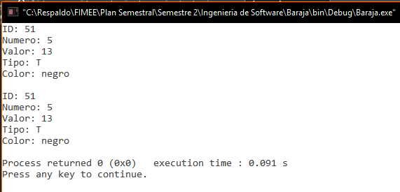
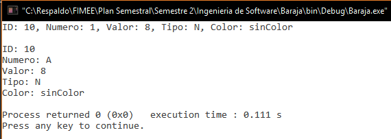
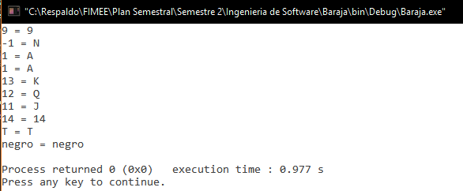
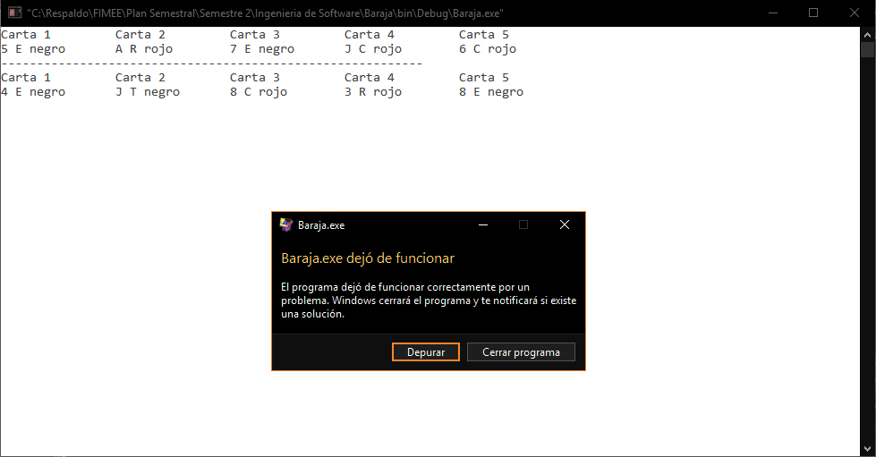
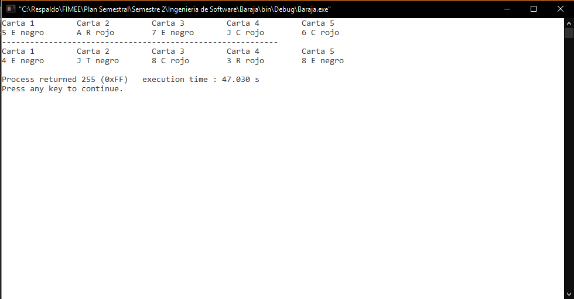

#Proyecto Baraja (Ingeniería de Software)

Documento que recaba todas las descripciones básicas y anotaciones que se han desarrollado, observaciones que se tienen y un apoyo en documentación del mismo proyecto realizado en lenguaje C. Se registran con fechas y observaciones en cada parte del programa.

##General
**05/10/16**. Se realizaron las pruebas de la función `int definirCarta(int id, int num, int value, char type, char* color, carta *elemento)`. Los resultados de la prueba se pueden observar en la respectiva carpeta (`/pruebas/definirCarta`).  

  

**05/10/16**. Se modificó y se realizaron las pruebas de la función `void imprimirCaractBaraja(carta baraja[], int length)`. Los resultados de la prueba se pueden observar en la respectiva carpeta (`/pruebas/imprimirCaractBaraja`).  

**04/Nov/16**. Se modificó y se realizaron las pruebas de la función `void imprimirCaractCarta(carta nombre)` por lo que no se detectaron fallos. Se construyó con anterioridad su respectivo grafo y se calculó su complejidad. Toda esta información puede ser vista en la carpeta `/pruebas/imprimirCaractCarta`.

**02/Nov/16**. Se realizaron las pruebas de la estructura y la función `void imprimirElementoCarta (carta nombre, int n)` por lo que no se detectaron fallos. Se construyó con anterioridad su respectivo grafo y se calculó su complejidad. Toda esta información puede ser vista en la carpeta `/pruebas/imprimirElementoCarta`.

  
**29/Oct/16**. Se creó el documento README.md para describir características y dar soporte al código. Se comentó parte del código con las características generales de lo que realiza cada función en las librerías. El error aún no se ha corregido, por lo que se ha decidido darle prioridad a su solución antes de continuar para evitar mal funcionamiento del programa más adelante.

**28/Oct/16**. Detectado un error 255 con el compilador Codeblocks al correr n veces el programa, aún no se encuentra la razón de tal debido a que se presenta aparentemente al azar. Se agregan unas imágenes del ya mencionado. 

  

##Baraja
Librería que contiene las funciones básicas del manejo de los elementos de una baraja en C.

###baraja.h (NO PROBADA ✘)
- `typedef struct {...}carta` **(PROBADA ✔)**. Estructura creada para contener los elementos de id, número, valor, tipo y color de una carta. *ID*, que sirve para darle un valor único a la carta y pueda ser usado en alguna otra parte. *Numero* que da el valor que tiene "físico". *Valor* que es el valor que se le da dependiendo del juego. *Tipo* que es uno de los cuatro que existen (E: Espadas, T: Treboles, C: Corazones y R: Rombos). Y el elemento *color* es asignado con memoria dinámica que puede tener tres (rojo, negro y sinColor).
- `void imprimirElementoCarta (carta nombre, int n)` **(PROBADA ✔)**. Imprime el elemento específico de una carta. 
- `void imprimirCaractCarta(carta nombre)` **(PROBADA ✔)**. Imprime todas las características de una carta. 
- `void imprimirCaractBaraja(carta baraja[], int length)` **(PROBADA ✔)**. Imprime todas las características de un arreglo de cartas (baraja). 
- `int definirCarta(int id, int num, int value, char type, char* color, carta *elemento)` **(PROBADA ✔)**. Crea una carta con todos los elementos que contiene. 
- `void liberarMemoria(carta baraja[], int length)`**(NO PROBADA ✘)**.  Libera la memoria de los elementos de un arreglo que usan memoria dinámica. 
- `int crearBaraja(carta baraja[])` **(NO PROBADA ✘)**. Crea un arreglo de tipo carta (baraja) con todos los tipos de cartas, y los elementos de cada una de ellas.
- `void barajear (carta baraja[])` **(NO PROBADA ✘)**. Desordena la baraja para que los elementos siempre salgan de manera aleatoria.

###baraja.c

- `void imprimirElementoCarta (carta nombre, int n)`.  
Imprime uno de los distintos elementos sin espacios y sin secuencias de escape. 
	+ **(CREADA 27/10/16)**. Hay que colocar n para indicar que es lo que se quiere que se imprima (1 = id, 2 = numero, 3 = valor, 4 = tipo y 5 = color). El valor del número es cambiante tomando como -1(comodín) y mostrándolo como N, 1 (As) mostrándolo como A, 11 como J, 12 como Q y 13 como K. Como recibe n los siguientes elementos 1 = id, 2 = numero, 3 = valor, 4 = tipo y 5 = color, falta analizar si se puede realizar de otra manera.
- `void imprimirCaractCarta(carta nombre)`.  
Imprime TODAS las características de una carta para pruebas del programador. 
	+ **(CREADA 27/10/16)**. El valor de número es cambiante tomando como -1(comodín) y mostrándolo como N, 1 (As) mostrándolo como A, 11 como J, 12 como Q y 13 como K.
	+ **(MODIFICADA 04/11/16)**. Se simplificó la función mandando llamar `void imprimirElementoCarta (carta nombre, int n)` para imprimir cada elemento.
- `void imprimirCaractBaraja(carta baraja[], int length)`.  
Imprime TODAS las características de cada carta contenida en el arreglo.  
	+ **(CREADA 27/10/16)**. Se requiere el largo del arreglo para ver el límite dentro de un ciclo *for* que realiza la impresión de las cartas. Desconozco si se puede realizar sin que el programador tenga que ingresarlo como parámetro.
	+ **(MODIFICADA 05/11/16)**. Se simplificó la función mandando llamar `void imprimirCaractCarta(carta nombre)` para imprimir cada carta contenida en el arreglo (baraja).
- `int definirCarta(int id, int num, int value, char type, char* color, carta *elemento)`.  
Crea una carta a partir de todos los elementos que contiene.
	+ **(CREADA 27/10/16)**. Es necesario colocar todos y cada uno de los parámetros que requiere la función. El color se asigna por memoria dinámica, a lo que regresa 1 la función cuando no se pudo asignarle para tal objetivo. Un parámetro es un apuntador a donde se encuentra la carta que se le darán tales valores.  
- `void liberarMemoria(carta baraja[], int length)`.  
Libera la memoria usada en *color* de cada elemento del arreglo.
	+ **(CREADA 27/10/16)**. En este caso, recibe un arreglo de tipo carta y el largo de este. Libera memoria de cada uno de los elementos ayudado con un ciclo *for*.
- `int crearBaraja(carta baraja[])`.   
Crea un arreglo de tipo carta (baraja) con todos los tipos de cartas.
	+ **(CREADA 27/10/16)**. Se da como valor fijo del arreglo 54 elementos, 13 cartas de los 4 tipos distintos que existen, más dos comodines. Como no se pudo colocar los símbolos de cada tipo de carta estos se representan con E = Espadas, T = Tréboles, C = Corazones y R = Rombos. Aquí los comodines poseen un valor númerico de -1 (N). Regresa el valor de 1 en caso de que no se haya podido asignar la memoria.  
- `void barajear (carta baraja[])`.  
Desordena el arreglo para que usando el azar pueda alterar el orden.
	+ **(CREADA 27/10/16)**. Usa la funcion `rand()` para realizar la tarea indicada además de crear otro arreglo de tipo carta para poder reemplazar el orden sin alterar la baraja original. ***NOTA: No fue posible liberar memoria de un arreglo tipo carta creado para dar soporte para desordenar las cartas. Crea un error al correr el programa. Checar tal error***.
	

##Poker
Librería de C que contiene todas las reglas y características de este juego. Se apoya en las funciones hechas en `baraja.h`.

###poker.h (NO PROBADA ✘)
- `void quitarJokers(carta baraja[], carta nBaraja[])` **(NO PROBADA ✘)**. Quita dos elementos carta del arreglo y crea una nueva baraja sin ellos. 
- `int repartirMano(carta baraja[], carta mano[], int n, int *carry, int max)` **(NO PROBADA ✘)**. Toma del arreglo baraja cinco cartas para darle a cada jugador.
- `void imprimirMano(carta mano[])` **(NO PROBADA ✘)**. Imprime la mano que tiene el jugador.  

###poker.c
- `void quitarJokers(carta baraja[], carta nBaraja[])`.  
Quita dos elementos carta del arreglo y crea una nueva baraja sin ellos.
	+ **(CREADA 27/10/16)**. La función busca en un ciclo *for* las cartas con numero -1, las que no tienen tal valor lo asignan al nuevo arreglo. Es importante mencionar que para que la función trabaje de la manera adecuada, el arreglo del primer parámetro debe de tener un largo de 54 elementos y el segundo de 52. *La función aún no se usa, pero se creo para colocar más adelante la opción de jugar sin comodines*.
- `int repartirMano(carta baraja[], carta mano[], int n, int *carry, int max)`.  
Se toma de una arreglo llamado baraja, elementos para conformar una mano.
	+ **(CREADA 27/10/16)**. La función toma de un arreglo baraja, una mano de 5 elementos para poder jugar. Se necesita además de estos dos elementos antes mencionados, n que es la cantidad de cartas que se tomará, un carry que lleva la cuenta de manera externa de la posición del arreglo baraja donde ya se tomaron las cartas, y el límite del arreglo baraja para comparar si aún existen cartas por tomar. Si se evalua el caso de ya no haber cartas para jugar, la función regresa un 1.
- `void imprimirMano(carta mano[])`  
Imprime los elementos que el jugador tiene como visibles para poder jugar.
	+ **(CREADA 27/10/16)**. La función se apoya de la la función `imprimirElementoCarta (...)` para imprimir el número de la carta. Se hace énfasis que como sólo imprime los elementos que el jugador debe conocer, estos se limitan al número de carta, tipo y color. Ordenadas de tal manera que fueron extraídas de la baraja. ***NOTA: A partir de que se usaba esta función se presentó un error 255 en el compilador, pero se desconoce si es por las funciones que aquí se usan o por la anterior que reparte la mano***.

##Principal

###main.c
- **(CREADO 27/10/16)**. Se probaron las funciones de manera básica para notar su funcionamiento, aún no se detectan dos de los posibles errores que el compilador arrojó, errores lógicos dados por el programador al parecer.

##Pruebas
- **05/10/16**. Se usó el archivo *driver_baraja.c* para realizar las distintas pruebas de la función `int definirCarta(int id, int num, int value, char type, char* color, carta *elemento)`. Los resultados de la prueba se pueden observar en la respectiva carpeta (`/pruebas/definirCarta`).  

- **05/10/16**. Se usó el archivo *driver_baraja.c* para realizar las distintas pruebas de la función `void imprimirCaractBaraja(carta baraja[], int length)`. Los resultados de la prueba se pueden observar en la respectiva carpeta (`/pruebas/imprimirCaractBaraja`).  

- **04/10/16**. Se usó el archivo *driver_baraja.c* para realizar las distintas pruebas de la función `void imprimirCaractCarta(carta nombre)`. Los resultados de la prueba se pueden observar en la respectiva carpeta (`/pruebas/imprimirCaractCarta`).  

- **02/10/16**. Se usó el archivo *driver_baraja.c* para realizar las distintas pruebas de la función `void imprimirElementoCarta (carta nombre, int n)`. Los resultados de la prueba se pueden observar en la respectiva carpeta (`/pruebas/imprimirElementoCarta`).  
 
- **02/10/16**. Se creó el *driver_baraja.c* para realizar las pruebas de la librería baraja.h.