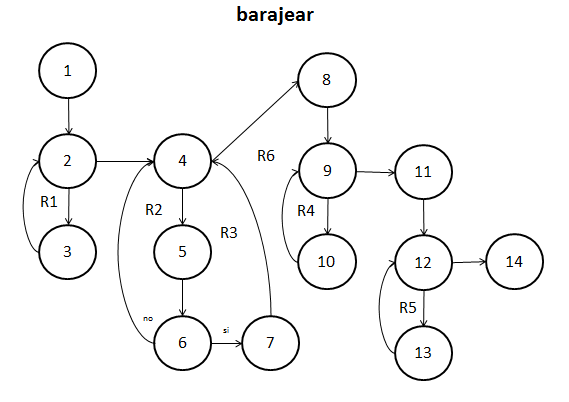

##Diseño
###baraja.c
`void barajear (carta baraja[])`.  

**08/11/16**. Se diseñó su grafo para poder calcular la complejidad de la función y poder realizar las pruebas unitarias de la función.  

 

Los elementos que representan los nodos son los siguientes:  
1. ***i = 0, cont = 0***. Inicializa los contadores a 0.  
2. ***for(i < 54)***. Se crea un ciclo for, si se cumple la condición pasa al siguiente nodo, sino pasa al siguiente ciclo.  
3. ***temp[i] = -1***. LLena el arreglo de valores de -1.  
4. ***i = 0***. Inicializa el contador a 0.  
5. ***for (i < 54)***. Se crea un ciclo for, si se cumple la condición pasa al siguiente nodo,sino pasa al siguiente ciclo. 
6. ***rand(), if (temp[azar] == -1)***. Saca un valor aleatorio. Si la posición al azar es igual a -1, entra al nodo 7, sino regresa al ciclo.  
7. ***i++, cont++, temp[azar] = cont***. Toma el valor del contador e incrementa los contadores.  
8. ***i = 0***. Inicializa el contador a 0.  
9. ***for (i < 54)***. Se crea un ciclo for, si se cumple la condición pasa al siguiente nodo, sino pasa al siguiente ciclo.  
10. ***Reemplazo***. Reemplaza las posiciones y toma los valores de la baraja nueva.  
11. ***i = 0***. Inicializa el contador en 0.  
12. ***for (i < 54)***. Se crea un ciclo for, si se cumple la condición pasa al siguiente nodo, sino termina la función.    
13. ***Reemplazo***. Da las cartas ya al azar.  
14. ***return***. Termina la función.  

####Complejidad ciclomática del grafo
Aplicando la fórmulas se obtiene lo siguiente:  
- *Número de regiones*. Se obtienen 6 regiones distintas incluyendo la exterior.  
- *V(G) = E - N + 2*. Aplicando la fórmula, se obtiene que el número de aristas(E) es de 18 y el de nodos (N) de 14, así que aplicando la fórmula nos da V(G) = 18 - 14 + 2 = 6.  
A lo que se deduce que 6 son las pruebas mínimas para recorrer todo el grafo. 

*NOTA: El algoritmo está diseñado para que se recorra todas las rutas cada vez que es llamada (sino se hace la función no hace su tarea) las pruebas se reducen a mandarla llamar y observar su comportamiento.*

##Pruebas
###driver_baraja.c
**CREADO 08/11/16**. Se usó el archivo driver_baraja.c para realizar las distintas pruebas de las funciones, entre ellas las pruebas unitarias.  

- **08/11/16**. Se probó la función barajeando 100 veces distintas, tras un tiempo aproximado de 35 segundos se logra un resultado ***EXITOSO ✔***.  

  

- **08/11/16**. Pruebas unitarias de la función con resultado ***EXITOSO ✔***. 