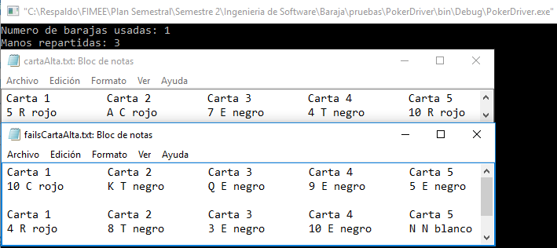

##Diseño
###poker.c
`int cartaMasAlta (carta mano[])`. 

**03/12/16**. Se diseñó su grafo para poder calcular la complejidad de la función y poder realizar las pruebas unitarias de la función.  

  

Los elementos que representan los nodos son los siguientes:  
1. ***for (i < length)***. Analiza la condición del ciclo, si no se cumple, termina la función.    
2. ***if (baraja[i].valor > alta)***. Checa si la carta es más alta.   
3. ***alta = mano[i].valor***. Asigna el valor alto.    
4. ***i++***. Incrementa el contador.  
5. ***return***. Termina la función.  

####Complejidad ciclomática del grafo
Aplicando la fórmulas se obtiene lo siguiente:  
- *Número de regiones*. Se obtienen 3 regiones distintas incluyendo la exterior.  
- *V(G) = E - N + 2*. Aplicando la fórmula, se obtiene que el número de aristas(E) es de 6 y el de nodos (N) de 5, así que aplicando la fórmula nos da V(G) = 6 - 5 + 2 = 3.  
A lo que se deduce que 3 son las pruebas mínimas para recorrer todo el grafo.  

*NOTA: Cada que la función es llamada, es recorrido el grafo en su totalidad, por lo que si la función se comporta de manera adecuada, su funcionamiento es asegurado.* 

##Pruebas
###driver_poker.c
**CREADO 03/12/16**. Se usó el archivo driver_poker.c para realizar las distintas pruebas de las funciones, entre ellas las pruebas unitarias.  

- **03/12/16**. Se probó la función buscando un As entre distintas manos repartidas, al final se logra un resultado ***EXITOSO ✔***.  

 