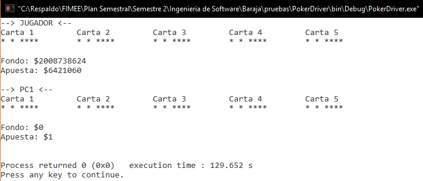

##Diseño
###poker.c
`void datos(jugador travis, int oculto)`. 

**28/11/16**. Se diseñó su grafo para poder calcular la complejidad de la función y poder realizar las pruebas unitarias de la función.  

  

Los elementos que representan los nodos son los siguientes:  
1. ***if (jugador)***. Selecciona si son los datos de un jugador o pc.  
2. ***printf(jugador)***. Imprime los datos de un jugador.  
3. ***printf(pc)***. Imprime los datos de una pc.  
4. ***printf(mano). Imprime la mano del jugador.  
5. ***return***. Termina la función.  

####Complejidad ciclomática del grafo
Aplicando la fórmulas se obtiene lo siguiente:  
- *Número de regiones*. Se obtienen 2 regiones distintas incluyendo la exterior.  
- *V(G) = E - N + 2*. Aplicando la fórmula, se obtiene que el número de aristas(E) es de 5 y el de nodos (N) de 5, así que aplicando la fórmula nos da V(G) = 5 - 5 + 2 = 2.  
A lo que se deduce que 2 son las pruebas mínimas para recorrer todo el grafo.  

*NOTA: Cada que la función es llamada, es recorrido el grafo en su totalidad, por lo que si la función se comporta de manera adecuada, su funcionamiento es asegurado.* 

##Pruebas
###driver_poker.c
**CREADO 28/11/16**. Se usó el archivo driver_poker.c para realizar las distintas pruebas de las funciones, entre ellas las pruebas unitarias.  

- **28/11/16**. Se probó la función imprimiendo 10,000 veces los datos de un jugador y una pc, tras un tiempo aproximado de 129 segundos se logra un resultado ***EXITOSO ✔***.  

 