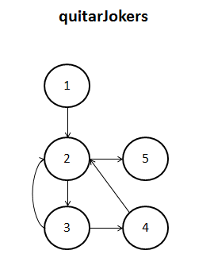
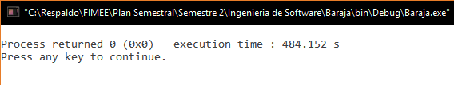

##Diseño
###poker.c
`void quitarJokers(carta baraja[], carta nBaraja[])`.  

**09/11/16**. Se diseñó su grafo para poder calcular la complejidad de la función y poder realizar las pruebas unitarias de la función.  

 

Los elementos que representan los nodos son los siguientes:  
1. ***i = 0, cont = 0***. Inicializa los contadores a 0.  
2. ***for(i < 54)***. Se crea un ciclo for, si se cumple la condición pasa al siguiente nodo, sino termina la función.  
3. ***if (baraja[i].numero != -1)***. Analiza si la carta no es un comodín.  
4. ***nBaraja[cont] = baraja[i]; cont++;***. Pasa la carta al nuevo arreglo, incrementa el contador.  
5. ***return***. Termina la función. 

####Complejidad ciclomática del grafo
Aplicando la fórmulas se obtiene lo siguiente:  
- *Número de regiones*. Se obtienen 3 regiones distintas incluyendo la exterior.  
- *V(G) = E - N + 2*. Aplicando la fórmula, se obtiene que el número de aristas(E) es de 6 y el de nodos (N) de 5, así que aplicando la fórmula nos da V(G) = 6 - 5 + 2 = 3.  
A lo que se deduce que 3 son las pruebas mínimas para recorrer todo el grafo. 

*NOTA: El algoritmo está diseñado para que se recorra todas las rutas cada vez que es llamada (sino se hace la función no hace su tarea) las pruebas se reducen a mandarla llamar y observar su comportamiento.*

##Pruebas
###driver_poker.c
**CREADO 09/11/16**. Se usó el archivo driver_poker.c para realizar las distintas pruebas de las funciones, entre ellas las pruebas unitarias.  

- **09/11/16**. Se probó la función quitando los comodines 10,000 veces distintas, tras un tiempo aproximado de 484 segundos se logra un resultado ***EXITOSO ✔***.

  

- **09/11/16**. Pruebas unitarias de la función con resultado ***EXITOSO ✔***. 