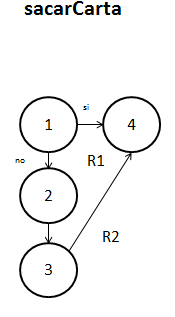

##Diseño
###poker.c
`int sacarCarta(carta baraja[], carta mano[], int posicion, int carry, int max)`. 

**27/11/16**. Se diseñó su grafo para poder calcular la complejidad de la función y poder realizar las pruebas unitarias de la función.  

  

Los elementos que representan los nodos son los siguientes:  
1. ***if (carry)***. Checa el carry, si lo sobrepasa termina la función si no, ejecuta la función.  
2. ***valor carta***. Asigna el valor correspondiente de la carta.  
3. ***carry++***. Actualiza el carry.  
4. ***return***. Termina la función.  

####Complejidad ciclomática del grafo
Aplicando la fórmulas se obtiene lo siguiente:  
- *Número de regiones*. Se obtienen 2 regiones distintas incluyendo la exterior.  
- *V(G) = E - N + 2*. Aplicando la fórmula, se obtiene que el número de aristas(E) es de 4 y el de nodos (N) de 4, así que aplicando la fórmula nos da V(G) = 4 - 4 + 2 = 2.  
A lo que se deduce que 2 son las pruebas mínimas para recorrer todo el grafo.  

*NOTA: Cada que la función es llamada, es recorrido el grafo en su totalidad, por lo que si la función se comporta de manera adecuada, su funcionamiento es asegurado.*  

##Pruebas
###driver_poker.c
**CREADO 27/11/16**. Se usó el archivo driver_poker.c para realizar las distintas pruebas de las funciones, entre ellas las pruebas unitarias.  

- **27/11/16**. Se probó la función sacando 10,000 cartas de la baraja, tras un tiempo aproximado de 0.42 segundos se logra un resultado ***EXITOSO ✔***.  

 
