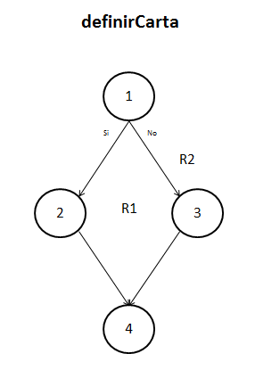
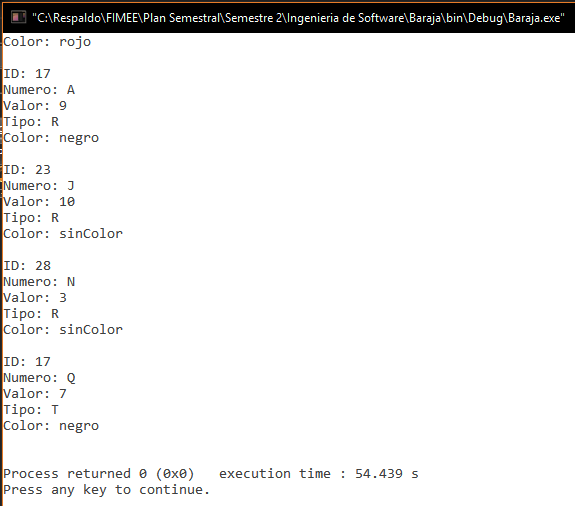
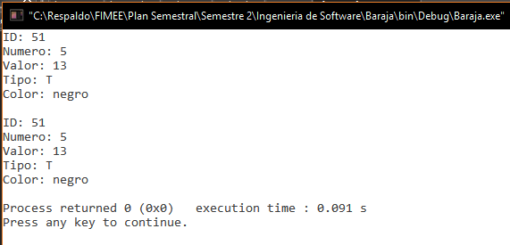

##Diseño
###baraja.c
`int definirCarta(int id, int num, int value, char type, char* color, carta *elemento)`.  

**05/11/16**. Se diseñó su grafo para poder calcular la complejidad de la función y poder realizar las pruebas unitarias de la función.  

  

Los elementos que representan los nodos son los siguientes:  
1. ***asignación, if(elemento->color == NULL)***. Toma los párametros (excepto color) y los asigna a los elementos referenciados del tipo carta. Compara si no hubo una asignación fallida al tipo color.  
2. ***fallo***. Si la asignación falló, se lo indica al programador.  
3. ***asignación***. Asigna la cadena color a la referencia de tipo carta.  
4. ***return***. Finaliza la función. 

####Complejidad ciclomática del grafo
Aplicando la fórmulas se obtiene lo siguiente:  
- *Número de regiones*. Se obtienen 2 regiones distintas incluyendo la exterior.  
- *V(G) = E - N + 2*. Aplicando la fórmula, se obtiene que el número de aristas(E) es de 4 y el de nodos (N) de 4, así que aplicando la fórmula nos da V(G) = 4 - 4 + 2 = 2.  
A lo que se deduce que 2 son las pruebas mínimas para recorrer todo el grafo.  

####Rutas posibles del grafo
Las siguientes son las rutas posibles que serán analizadas en las pruebas unitarias de la función:  
1. 1, 3, 4.  
2. 1, 2, 4. 

En este caso sólo 1 es una ruta válida, ya que la ruta 2, aunque en el grafo se presenta como una ruta recorrible, en la lógica de la función construida no es posible acceder (tal caso es cuando la asignación de memoria falla, cosa imposible en este caso pero por convención se coloca tal if).

##Pruebas
###driver_baraja.c
**CREADO 05/10/16**. Se usó el archivo driver_baraja.c para realizar las distintas pruebas de las funciones, entre ellas las pruebas unitarias.  

- **05/10/16**. Se probó la función creando 10,000 cartas al azar usando la función, la cual no detectó ningún problema. Se observó que tras 55 segundos aproximadamente, la prueba obtiene un resultado ***EXITOSO ✔***.

 

- **05/10/16**. Pruebas unitarias de la función usando la macro `assert()` con resultado ***EXITOSO ✔***.

####Ruta 1: 1, 3, 4.  

