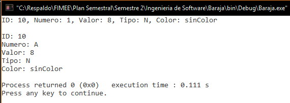

##Diseño
###baraja.c
`void imprimirCaractCarta(carta nombre)`

**04/11/16**. Se diseñó su grafo para poder calcular la complejidad de la función y poder realizar las pruebas unitarias de la función.  

  

Los elementos que representan los nodos son los siguientes:  
1. ***printf***. Se hacen todas las impresiones (5 en este caso), mandando llamar la función `void imprimirElementoCarta (carta nombre, int n)`.  
2. ***return***. Imprime el id de la carta.

####Complejidad ciclomática del grafo
Aplicando la fórmulas se obtiene lo siguiente:  
- *Número de regiones*. Se obtiene 1 región (sólo la exterior).  
- *V(G) = E - N + 2*. Aplicando la fórmula, se obtiene que el número de aristas(E) es de 1 y el de nodos (N) de 2, así que aplicando la fórmula nos da V(G) = 1 - 2 + 2 = 1.  
A lo que se deduce que 1 son las pruebas mínimas para recorrer todo el grafo.

####Rutas posibles del grafo
Las única ruta posible que será analizada en las pruebas unitarias de la función es:  
1. 1, 2.

##Pruebas
###driver_baraja.c
**CREADO 04/10/16**. Se usó el archivo driver_baraja.c para realizar las distintas pruebas de las funciones, entre ellas las pruebas unitarias.  

- **04/10/16**. Se probó la función con 10,000 número de casos distintos dados al azar, dando un resultado ***EXITOSO ✔***.  

  

- **04/10/16**. Pruebas unitarias de la función con resultado ***EXITOSO ✔***.  
Las rutas a analizar son las siguientes:  

####Ruta 1: 1, 2.

