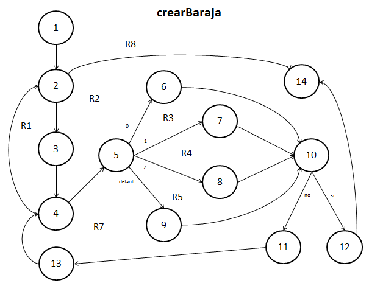
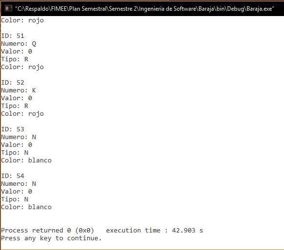

##Diseño
###baraja.c
`int crearBaraja(carta cartas[])`.  

**05/11/16**. Se diseñó su grafo para poder calcular la complejidad de la función y poder realizar las pruebas unitarias de la función.  

  

Los elementos que representan los nodos son los siguientes:  
1. ***a = 0***. Inicializa la variable a.  
2. ***for(a < 4)***. Se crea un ciclo for, si se cumple la condición pasa al siguiente nodo, en caso de que no, termina la función.  
3. ***i = 0***. Inicializa la variable i.  
4. ***for (i < 13)***. Se crea un ciclo for, si se cumple la condición pasa al siguiente nodo, en caso de que no, regresa al nodo 2.  
5. ***switch (a)***. El nodo que toma 4 decisiones distintas dependiendo del valor de a.  
6. ***case 0***. Define las cartas tipo espadas.  
7. ***case 1***. Define las cartas tipo trébol.  
8. ***case 2***. Define las cartas tipo corazón.  
9. ***default***. Define las cartas tipo rombo.  
10. ***if (error > 0)***. Toma una decisión si encontró un error.  
11. ***Incremento***. Incrementa id en 1.  
12. ***Error***. Se detecta un error en la función.  
13. ***Incremento***. Se incrementas las variables de control de los ciclos.  
14. ***return***. Termina la función.  

####Complejidad ciclomática del grafo
Aplicando la fórmulas se obtiene lo siguiente:  
- *Número de regiones*. Se obtienen 8 regiones distintas incluyendo la exterior.  
- *V(G) = E - N + 2*. Aplicando la fórmula, se obtiene que el número de aristas(E) es de 20 y el de nodos (N) de 14, así que aplicando la fórmula nos da V(G) = 20 - 14 + 2 = 8.  
A lo que se deduce que 8 son las pruebas mínimas para recorrer todo el grafo. 

####Rutas posibles del grafo
Las siguientes son las rutas posibles que serán analizadas en las pruebas unitarias de la función:  
1. 1, 2, 3, 4, 5, 6, 10, 11, 13, 4, ..., 4, 2, 14.  
2. 1, 2, 3, 4, 5, 7, 10, 11, 13, 4, ..., 4, 2, 14.  
3. 1, 2, 3, 4, 5, 8, 10, 11, 13, 4, ..., 4, 2, 14.  
4. 1, 2, 3, 4, 5, 9, 10, 11, 13, 4, ..., 4, 2, 14.  
5. 1, 2, 3, 4, 5, 6, 10, 12, 14.  
6. 1, 2, 3, 4, 5, 7, 10, 12, 14.  
7. 1, 2, 3, 4, 5, 8, 10, 12, 14.  
8. 1, 2, 3, 4, 5, 9, 10, 12, 14.  

*NOTA: Debido a que la función es plenamente controlada por el programa, no es posible entrenar las rutas a voluntad sin antes modificar la función, por lo que las rutas 1, 2, 3 y 4 son recorridas plenamente en el programa, dejando inválidas a las 4 restantes debido a que sólo si se hace una modificación bastante grande a la función, generará un error de la memoria que es la forma en la que se entra a las rutas restantes.*

##Pruebas
###driver_baraja.c
**CREADO 05/11/16**. Se usó el archivo driver_baraja.c para realizar las distintas pruebas de las funciones, entre ellas las pruebas unitarias.  

- **05/11/16**. Se probó la función creando 100 veces una baraja, tras un tiempo aproximado de 42 segundo se logra un resultado ***EXITOSO ✔***.

  

- **05/11/16**. Pruebas unitarias de la función con resultado ***EXITOSO ✔***. 