##Diseño
###baraja.c
void imprimirElementoCarta (carta nombre, int n)`.  

**02/11/16**. Se diseñó su grafo para poder calcular la complejidad de la función y poder realizar las pruebas unitarias de la función.
	
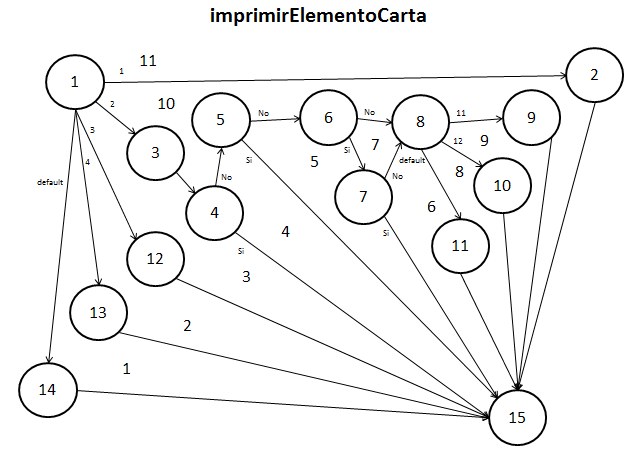  

Los elementos que representan los nodos son los siguientes:  
1. ***switch(n)***. La decisión de que camino se va a tomar.  
2. ***case 1***. Imprime el id de la carta.  
3. ***case 2***. Analiza cuando se debe imprimir el número de la carta.  
4. ***if (num == -1)***. Imprime el número cuando es un comodín.  
5. ***if (num == 1)***. Imprime el número cuando es un As.  
6. ***if (num > 1)***. Analiza si hay un rango de valores.  
7. ***if (num <= 10)***. Verifica si el rango de valor existe e imprime el valor normal del num.  
8. ***switch(num)***. Para analizar los casos faltantes.  
9. ***case 11***. Imprime el número de J.  
10. ***case 12***. Imprime el número de Q.  
11. ***default***. Imprime el número de K.  
12. ***case 3***. Imprime el valor de la carta.  
13. ***case 4***. Imprime el tipo de la carta.  
14. ***default***. Imprime el color de la carta.  
15. ***return***. Termina la función.  

####Complejidad ciclomática del grafo 
Aplicando la fórmulas se obtiene lo siguiente:  
	+  *Número de regiones*. Se obtienen 11 regiones distintas incluyendo la exterior.  
	+  *V(G) = E - N + 2*. Aplicando la fórmula, se obtiene que el número de aristas(E) es de 24 y el de nodos (N) de 15, así que aplicando la fórmula nos da V(G) = 24 - 15 + 2 = 11.  
A lo que se deduce que 11 son las pruebas mínimas para recorrer todo el grafo.  

####Rutas posibles del grafo
Las siguientes son las rutas posibles que serán analizadas en las pruebas unitarias de la función:  
1. 1, 2, 15.  
2. 1, 3, 4, 15.  
3. 1, 3, 4, 5, 15.  
4. 1, 3, 4, 5, 6, 7, 15.  
5. 1, 3, 4, 5, 6, 8, 10, 15.  
6. 1, 3, 4, 5, 6, 7, 8, 11, 15.  
7. 1, 3, 4, 5, 6, 7, 8, 10, 15.  
8. 1, 3, 4, 5, 6, 7, 8, 9, 15.  
9. 1, 12, 15.  
10. 1, 13, 15.  
11. 1, 14, 15.  

En este caso sólo 10 rutas son válidas, ya que la ruta 5, aunque en el grafo se presenta como una ruta recorrible, en la lógica del código no es posible acceder.
	

##Pruebas
###driver_baraja.c
**(CREADO 02/10/16)**. Se usó el archivo driver_baraja.c para realizar las distintas pruebas de las funciones, entre ellas las pruebas unitarias.  

- **02/10/16**. Se probó la función con 10,000 número de casos distintos dados al azar, dando un resultado ***EXITOSO ✔***.

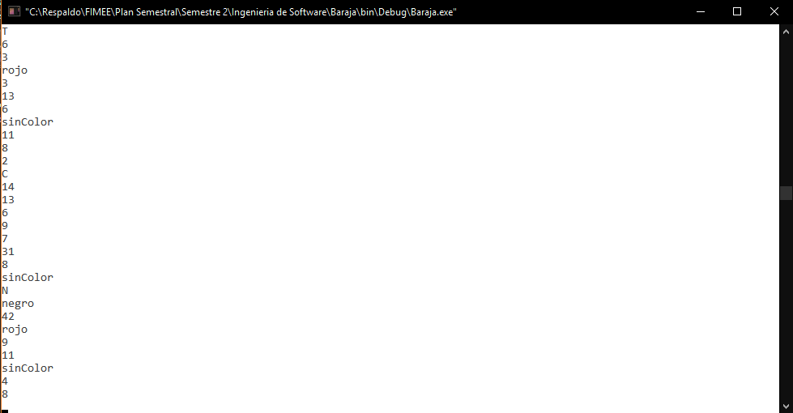  

- **02/10/16**. Pruebas unitarias de la función ***EXITOSO ✔***.  
Código con el que se realizaron las pruebas (a menos que se haya hecho un cambio en especifico para entrar a la ruta).  

~~~  
carta elemento;  
elemento.id = 9;  
elemento.numero = 10;  
elemento.valor = 14;  
elemento.tipo = 'T';  
elemento.color = malloc(strlen(NEGRO) * sizeof(char));  
strcpy(elemento.color, NEGRO);  
~~~  

1. Ruta: 1, 2, 15.  
~~~  
printf("%d = ", elemento.id);  
imprimirElementoCarta(elemento, 1);  
printf("\n");  
~~~  

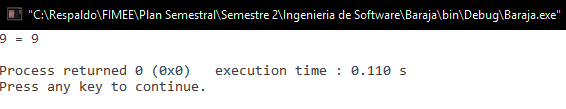

2. Ruta: 1, 3, 4, 15.  
~~~  
elemento.numero = -1;  
printf("%d = ", elemento.numero);  
imprimirElementoCarta(elemento, 2);  
printf("\n");  
~~~  

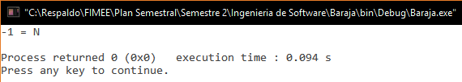  

*N en el programa representa el número de Comodín, por lo que se ve que es correcto*  

3. Ruta: 1, 3, 4, 5, 15.  
~~~  
elemento.numero = 1;  
printf("%d = ", elemento.numero);  
imprimirElementoCarta(elemento, 2);  
printf("\n");  
~~~  

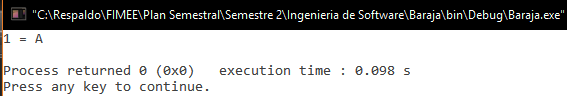  

*A en el programa representa el número de 1, por lo que se ve que es correcto*  
  
4. Ruta: 1, 3, 4, 5, 6, 7, 15.  
~~~  
printf("%d = ", elemento.numero);  
imprimirElementoCarta(elemento, 2);  
printf("\n");  
~~~  

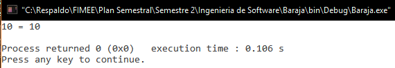  

5. Ruta: 1, 3, 4, 5, 6, 8, 10, 15. (**NO VALIDA**)  
 
6. Ruta: 1, 3, 4, 5, 6, 7, 8, 11, 15.  
~~~  
elemento.numero = 13;  
printf("%d = ", elemento.numero);  
imprimirElementoCarta(elemento, 2);  
printf("\n");  
~~~  

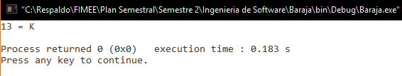  

*K en el programa representa el número de 13, por lo que se ve que es correcto*

7. Ruta: 1, 3, 4, 5, 6, 7, 8, 10, 15.  
~~~  
elemento.numero = 12;  
printf("%d = ", elemento.numero);  
imprimirElementoCarta(elemento, 2);  
printf("\n");  
~~~  

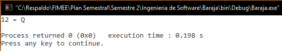  

*Q en el programa representa el número de 12, por lo que se ve que es correcto*  

8. Ruta: 1, 3, 4, 5, 6, 7, 8, 9, 15.  
~~~  
elemento.numero = 11;  
printf("%d = ", elemento.numero);  
imprimirElementoCarta(elemento, 2);  
printf("\n");  
~~~  

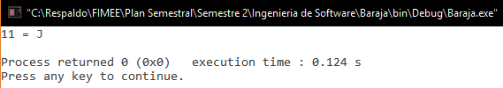  

*J en el programa representa el número de 11, por lo que se ve que es correcto*  

9. Ruta: 1, 12, 15.  
~~~  
printf("%d = ", elemento.valor);  
imprimirElementoCarta(elemento, 3);  
printf("\n");  
~~~  

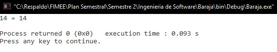  

10. Ruta: 1, 13, 15.  
~~~  
printf("%c = ", elemento.tipo);  
imprimirElementoCarta(elemento, 4);  
printf("\n");  
~~~  

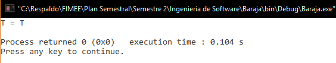  

11. Ruta: 1, 14, 15.  
~~~  
printf("%s = ", elemento.color);  
imprimirElementoCarta(elemento, 5);  
printf("\n");  
~~~  

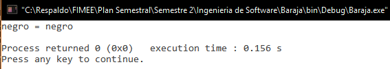 