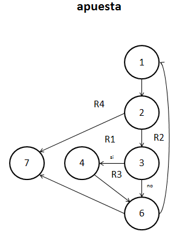
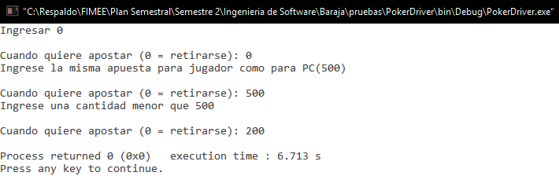

##Diseño
###poker.c
`int apostar(int *fondo, int *apuesta, int *total, int numero, int n)`. 

**01/12/16**. Se diseñó su grafo para poder calcular la complejidad de la función y poder realizar las pruebas unitarias de la función.  

  

Los elementos que representan los nodos son los siguientes:  
1. ***do, scanf***. Inicia el do y lee la apuesta del jugador.  
2. ***if (cantidad)***. Si la cantidad es igual a 0, la función regresa un error.  
3. ***if (cantidad > fondo)***. No deja apostar más dinero que la que se cuenta.  
4. ***printf***. Imprime un mensaje de error.  
6. ****while(cantidad > fondo)***. Analiza si regresa al do, si la cantidad es mayor que el fondo.  
7. ***return***. Termina la función.  

####Complejidad ciclomática del grafo
Aplicando la fórmulas se obtiene lo siguiente:  
- *Número de regiones*. Se obtienen 4 regiones distintas incluyendo la exterior.  
- *V(G) = E - N + 2*. Aplicando la fórmula, se obtiene que el número de aristas(E) es de 8 y el de nodos (N) de 6, así que aplicando la fórmula nos da V(G) = 8 - 6 + 2 = 4.  
A lo que se deduce que 4 son las pruebas mínimas para recorrer todo el grafo.  

*NOTA: Cada que la función es llamada, es recorrido el grafo en su totalidad, por lo que si la función se comporta de manera adecuada, su funcionamiento es asegurado.*  

##Pruebas
###driver_poker.c
**CREADO 01/12/16**. Se usó el archivo driver_poker.c para realizar las distintas pruebas de las funciones, entre ellas las pruebas unitarias.  

- **01/12/16**. Se probó la función asignando valores dados por el usuario y se logra un resultado ***EXITOSO ✔***.  

 