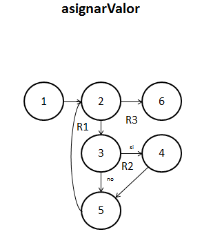
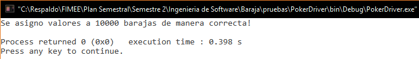

##Diseño
###poker.c
`void asignarValor(carta baraja[], int length)`. 

**26/11/16**. Se diseñó su grafo para poder calcular la complejidad de la función y poder realizar las pruebas unitarias de la función.  

  

Los elementos que representan los nodos son los siguientes:  
1. ***i = 0***. Inicializa el contador a 0.  
2. ***for (i < length)***. Analiza la condición del ciclo, si no se cumple, termina la función.  
3. ***if (baraja[i].numero == 1)***. Checa si la carta es una As.  
4. ***baraja[i].valor = 14***. Da el valor fijo al As.  
5. ****else***. Da valores a las cartas faltantes.  
6. ***return***. Termina la función.  

####Complejidad ciclomática del grafo
Aplicando la fórmulas se obtiene lo siguiente:  
- *Número de regiones*. Se obtienen 3 regiones distintas incluyendo la exterior.  
- *V(G) = E - N + 2*. Aplicando la fórmula, se obtiene que el número de aristas(E) es de 7 y el de nodos (N) de 6, así que aplicando la fórmula nos da V(G) = 7 - 6 + 2 = 3.  
A lo que se deduce que 3 son las pruebas mínimas para recorrer todo el grafo.  

*NOTA: Cada que la función es llamada, es recorrido el grafo en su totalidad, por lo que si la función se comporta de manera adecuada, su funcionamiento es asegurado.* 

##Pruebas
###driver_poker.c
**CREADO 26/11/16**. Se usó el archivo driver_poker.c para realizar las distintas pruebas de las funciones, entre ellas las pruebas unitarias.  

- **26/11/16**. Se probó la función asignando valores a 10,000 barajas, tras un tiempo aproximado de 0.31 segundos se logra un resultado ***EXITOSO ✔***.  

 