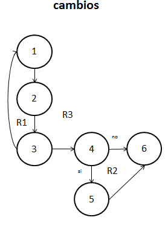
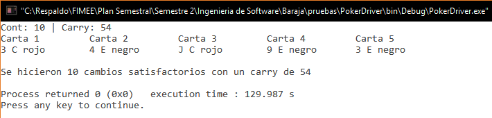

##Diseño
###poker.c
`int cambios(carta baraja[], carta mano[], int *carry, int max)`. 

**27/11/16**. Se diseñó su grafo para poder calcular la complejidad de la función y poder realizar las pruebas unitarias de la función.  

  

Los elementos que representan los nodos son los siguientes:  
1. ***Pregunta al usuario***. Imprime un mensaje para preguntar al usuario cuantas cartas va a cambiar.  
2. ***scanf***. Guarda el valor dado por el usuario.  
3. ***while;***. Checa si el valor es válido, si no lo es, regresa al nodo 1.  
4. ***valor > 0***. Analiza si el valor es mayor a 0.  
5. ***Cambio***. Hace el cambio de las cartas pedidas.  
6. ***return***. Termina la función.  

####Complejidad ciclomática del grafo
Aplicando la fórmulas se obtiene lo siguiente:  
- *Número de regiones*. Se obtienen 3 regiones distintas incluyendo la exterior.  
- *V(G) = E - N + 2*. Aplicando la fórmula, se obtiene que el número de aristas(E) es de 7 y el de nodos (N) de 7, así que aplicando la fórmula nos da V(G) = 7 - 6 + 2 = 3.  
A lo que se deduce que 3 son las pruebas mínimas para recorrer todo el grafo.  

*NOTA: Cada que la función es llamada, es recorrido el grafo en su totalidad, por lo que si la función se comporta de manera adecuada, su funcionamiento es asegurado.*  

##Pruebas
###driver_poker.c
**CREADO 27/11/16**. Se usó el archivo driver_poker.c para realizar las distintas pruebas de las funciones, entre ellas las pruebas unitarias.  

- **27/11/16**. Se probó la función haciendo cambios hasta que la baraja se terminara. Se descubrieron 2 errores importantes que fueron corregidos. La función al final tuvo un comportamiento ***EXITOSO ✔***.  

  