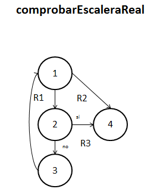
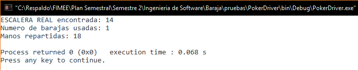

##Diseño
###poker.c
`int comprobarEscaleraReal (carta mano[], char tipo, int comodines)`. 

**04/12/16**. Se diseñó su grafo para poder calcular la complejidad de la función y poder realizar las pruebas unitarias de la función.  

  

Los elementos que representan los nodos son los siguientes:  
1. ***i = 0***. Inicializa el contador a 0.  
2. ***if (trio)***. Checa si encuentra una escalera en la mano.  
3. ***i++***. Incrementa el contador.  
4. ***return***. Termina la función.  

####Complejidad ciclomática del grafo
Aplicando la fórmulas se obtiene lo siguiente:  
- *Número de regiones*. Se obtienen 3 regiones distintas incluyendo la exterior.  
- *V(G) = E - N + 2*. Aplicando la fórmula, se obtiene que el número de aristas(E) es de 5 y el de nodos (N) de 4, así que aplicando la fórmula nos da V(G) = 5 - 4 + 2 = 3.  
A lo que se deduce que 3 son las pruebas mínimas para recorrer todo el grafo.  

##Pruebas
###driver_poker.c
**CREADO 04/12/16**. Se usó el archivo driver_poker.c para realizar las distintas pruebas de las funciones, entre ellas las pruebas unitarias.  

- **04/12/16**. Se probó la función hasta encontrar una escalera real, lo que al final se obtuvo un resultado ***EXITOSO ✔***.  

 