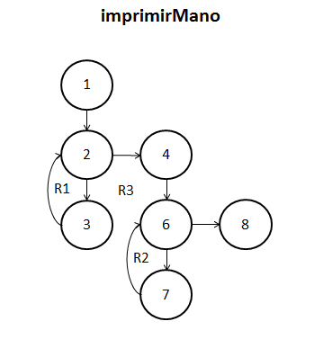
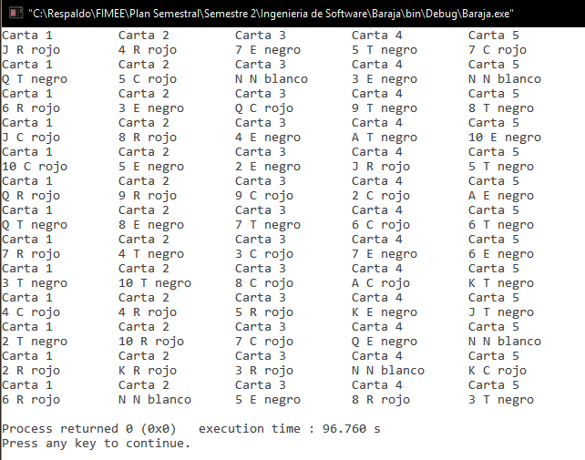

##Diseño
###poker.c
`void imprimirMano(carta mano[])`. 

**10/11/16**. Se diseñó su grafo para poder calcular la complejidad de la función y poder realizar las pruebas unitarias de la función.  

 

Los elementos que representan los nodos son los siguientes:  
1. ***i = 0***. Inicializa i a 0.  
2. ***if (i < 5)***. Analiza la condición, si no se cumple, pasa al nodo 4.  
3. ***Imprime mensaje***. Imprime el número de carta de la mano.  
4. ***i = 0***. Inicializa i a 0.  
5. ***if (i < 5)***. Analiza la condición, si no se cumple, termina la función.  
6. ***Imprime carta***. Imprime la carta.  
7. ***return***. Termina la función.  

####Complejidad ciclomática del grafo
Aplicando la fórmulas se obtiene lo siguiente:  
- *Número de regiones*. Se obtienen 3 regiones distintas incluyendo la exterior.  
- *V(G) = E - N + 2*. Aplicando la fórmula, se obtiene que el número de aristas(E) es de 8 y el de nodos (N) de 7, así que aplicando la fórmula nos da V(G) = 8 - 7 + 2 = 3.  
A lo que se deduce que 3 son las pruebas mínimas para recorrer todo el grafo. 

##Pruebas
###driver_poker.c
**CREADO 10/11/16**. Se usó el archivo driver_poker.c para realizar las distintas pruebas de las funciones, entre ellas las pruebas unitarias.  

- **10/11/16**. Se probó la función imprimiendo 10,000 veces manos distintas (de 5 cartas), tras un tiempo aproximado de 97 segundos se logra un resultado ***EXITOSO ✔***.

  

- **10/11/16**. Pruebas unitarias de la función con resultado ***EXITOSO ✔***. 