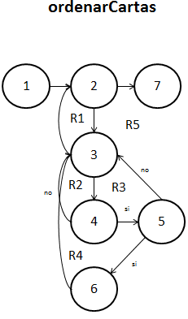

##Diseño
###poker.c
`void ordenarCartas(carta monton[], int length, int v)`. 

**26/11/16**. Se diseñó su grafo para poder calcular la complejidad de la función y poder realizar las pruebas unitarias de la función.  

  

Los elementos que representan los nodos son los siguientes:  
1. ***i = 0***. Inicializa el contador a 0.  
2. ***for (i < length)***. Analiza la condición del ciclo, si no se cumple, termina la función.  
3. ***for (j < length)***. Analiza la condición del ciclo, si no se cumple, regresa al ciclo anterior. 
4. ***if (prioridad)***. Checa la prioridad de la carta.  
5. ***if (prioridad)***. Checa un rango de la prioridad.  
6. ****Ordenamiento***. Ordena el rango de valores dados.  
7. ***return***. Termina la función.  

####Complejidad ciclomática del grafo
Aplicando la fórmulas se obtiene lo siguiente:  
- *Número de regiones*. Se obtienen 5 regiones distintas incluyendo la exterior.  
- *V(G) = E - N + 2*. Aplicando la fórmula, se obtiene que el número de aristas(E) es de 10 y el de nodos (N) de 7, así que aplicando la fórmula nos da V(G) = 10 - 7 + 2 = 5.  
A lo que se deduce que 3 son las pruebas mínimas para recorrer todo el grafo.  

*NOTA: Cada que la función es llamada, es recorrido el grafo en su totalidad, por lo que si la función se comporta de manera adecuada, su funcionamiento es asegurado.*  

##Pruebas
###driver_poker.c
**CREADO 26/11/16**. Se usó el archivo driver_poker.c para realizar las distintas pruebas de las funciones, entre ellas las pruebas unitarias.  

- **26/11/16**. Se probó la función ordenando 10,000 manos distintas, tras un tiempo aproximado de 0.48 segundos se logra un resultado ***EXITOSO ✔***.  

 