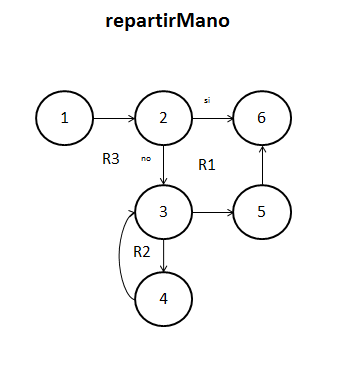
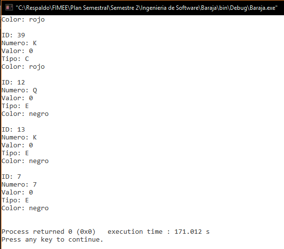
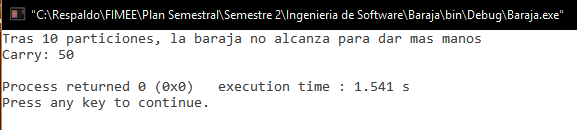

##Diseño
###poker.c
`int repartirMano(carta baraja[], carta mano[], int n, int *carry, int max)`. 

**09/11/16**. Se diseñó su grafo para poder calcular la complejidad de la función y poder realizar las pruebas unitarias de la función.  

 

Los elementos que representan los nodos son los siguientes:  
1. ***i = 0, cont = 0***. Inicializa los contadores a 0.  
2. ***if (*carry + n > max)***. Analiza la condición, si se cumple, termina la función.  
3. ***for (i < *carry + n)***. Comienza un ciclo for, repartiendo las cartas solicitadas.  
4. ***reparte; cont++;***. Da las cartas solicitadas y aumenta el contador.  
5. ****carry += n;***. Aumenta el carry para llevar control sobre la baraja.
6. ***return***. Termina la función.  

####Complejidad ciclomática del grafo
Aplicando la fórmulas se obtiene lo siguiente:  
- *Número de regiones*. Se obtienen 3 regiones distintas incluyendo la exterior.  
- *V(G) = E - N + 2*. Aplicando la fórmula, se obtiene que el número de aristas(E) es de 7 y el de nodos (N) de 6, así que aplicando la fórmula nos da V(G) = 7 - 6 + 2 = 3.  
A lo que se deduce que 3 son las pruebas mínimas para recorrer todo el grafo. 

##Pruebas
###driver_poker.c
**CREADO 09/11/16**. Se usó el archivo driver_poker.c para realizar las distintas pruebas de las funciones, entre ellas las pruebas unitarias.  

- **09/11/16**. Se probó la función repartiendo 10,000 veces manos distintas (de 5 cartas), tras un tiempo aproximado de 171 segundos se logra un resultado ***EXITOSO ✔***.

  

- **09/11/16**. Pruebas unitarias de la función con resultado ***EXITOSO ✔***.  

  